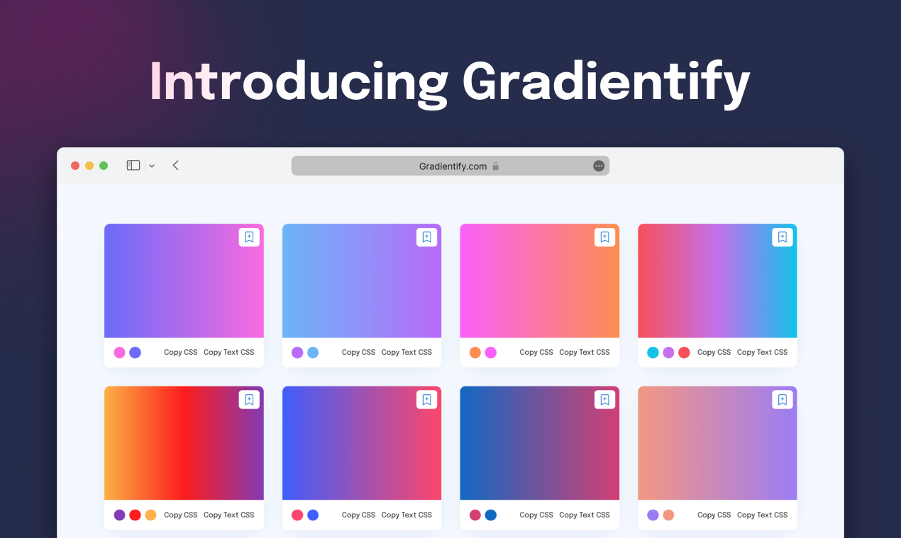

<p align="center">
<a href="https://www.gradientify.com/">

</a>
</p>

<p align="center">
<a href="https://www.gradientify.com/">

</a>
</p>

<h3 align="center">Find the perfect gradient for your next projects</h3>

<p align="center">
<a href="https://www.producthunt.com/products/gradientify?utm_source=badge-top-post-badge&utm_medium=badge&utm_souce=badge-gradientify" target="_blank"></a>
</p>


### Introducing Gradientify

Gradientify is a web-based all-in-one gradient editor that gives you access to 100+ trendy and beautiful gradients for your next projects, Copy CSS Snippet, Download PNGs, generates gradient from an image, and easily make tints and shades of a single color.

[Read Blog](https://thenitinsingh.hashnode.dev/gradientify)

<p align="center">

</p>

---

<a href="https://www.gradientify.com/">

</a>

## 😍 Features

Gradientify offers a huge collection of elegant gradients. you can use it for free without attribution.

- **🌈 100+ trendy gradients**
- **⚡ Make tints and Shades**
- **😍 Generate Gradient**
- **➕ Add new Gradient**
- **✨ Save Gradients**
- **🔄 Rotate Gradients**
- **⏬ Download PNGs**
- **👩‍💻 Copy CSS Snippets, CSS text Snippets**
- **🔍 Search by Hex**
- **👬 Contributor's page**
- **💻 Progressive Web App Support, Installable app**
- **🌙 Dark mode**
- **📱 Use on Any Device**
- **📲 Smooth animations**

## 🛠️ Installation Steps

1. Clone the repository

```bash
git clone https://github.com/singhnitin77/gradientify.git
```

2. Change the working directory

```bash
cd gradientify
```

3. Install dependencies

```bash
npm install
```

4. Run the app

```bash
npm start
```

## Contributing

Adding a gradient to gradientify is easy. All gradients are read from a [`gradients.json`](gradients.json) file which is available in this project's repo. Simply add your gradient details to it and submit a pull request.

> Add your gradient colors in the HEX format along with a id to the end of the js file and submit a pull request

```javascript
{
    colors: ["#F86BDF", "#6B6BF8"],
    id: 1,
},
```

After your PR gets merged, you'll be automatically appeared on [contributors page](https://gradientify/contributors). through Github API.

Please contribute using [GitHub Flow](https://guides.github.com/introduction/flow). Create a branch, add commits, and [open a pull request](https://github.com/singhnitin77/gradientify/compare).

Please read [`CONTRIBUTING`](CONTRIBUTING.md) for details on our [`CODE OF CONDUCT`](CODE_OF_CONDUCT.md), and the process for submitting pull requests to us.

## Built with

- [React](https://reactjs.org/)
- [Tailwind CSS](): For complete styling
- [Material UI](http://material-ui.com/): For Component Styling
- [Animate.css](https://animate.style/): for smooth Animations
- [AOS](https://michalsnik.github.io/aos/): For scroll animations
- [react-router-dom](https://reactrouter.com/web/guides/quick-start): For routing
- [react-icons](): For Icons
- [react-hot-toast](): For toasts
- [Vercel](): For frontend and Backend Hosting
- [Node Js]():
- [Express Js]():
- [Mongo DB](): For Storing Gradients Database

## License

This project is licensed under the MIT License - see the [`LICENSE`](LICENSE) file for details.

## 👨‍💻 Huge thanks to the Contributors

Gradientify is empowered by various contributors. A big thanks to all the amazing contributors who helped gradientify! Thank you! We thank all of them wholeheartedly.

Feel free to contribute in the project 🙌 Keep help us grow

<a href="https://github.com/singhnitin77/gradientify/graphs/contributors">
  
</a>

## 🙏 Support

This project needs a 🌟 from you
